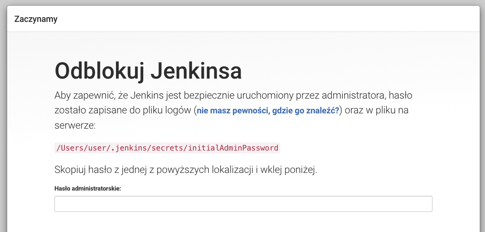
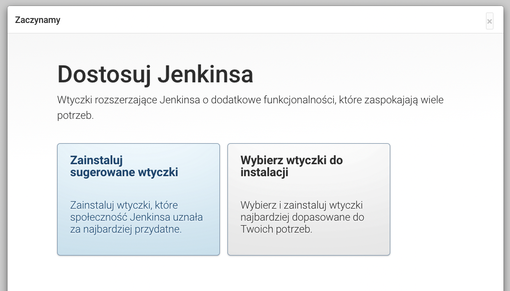
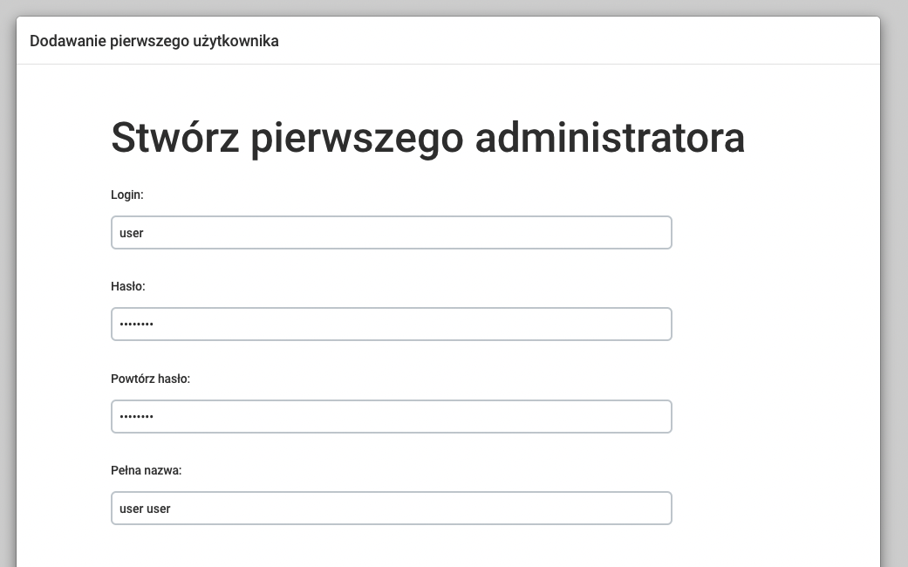
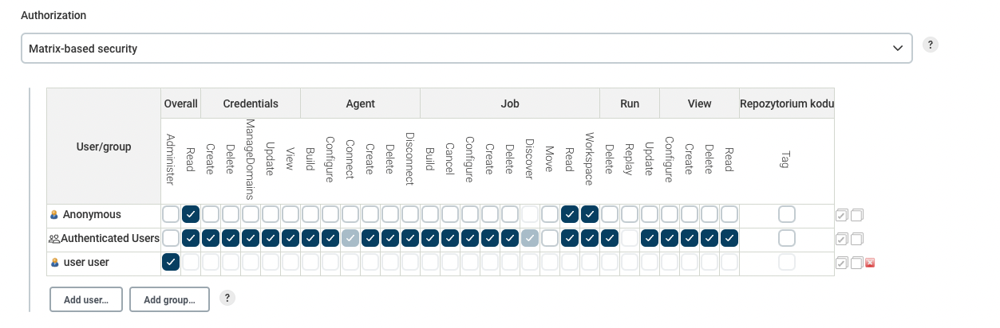
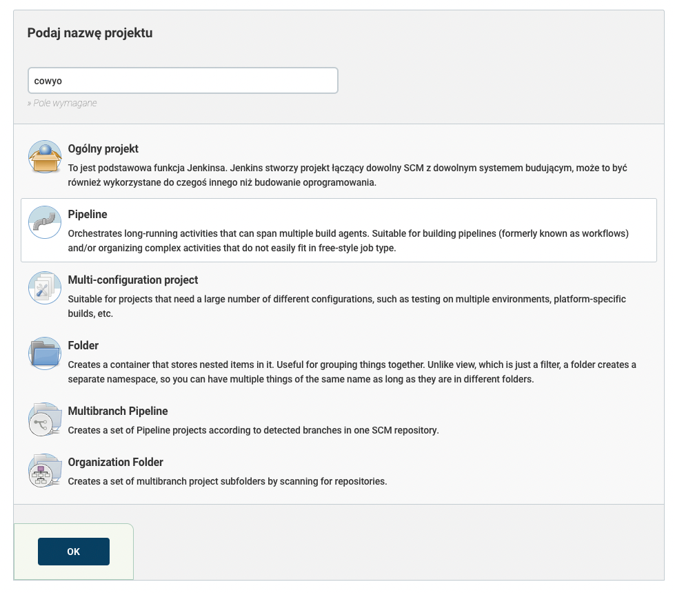
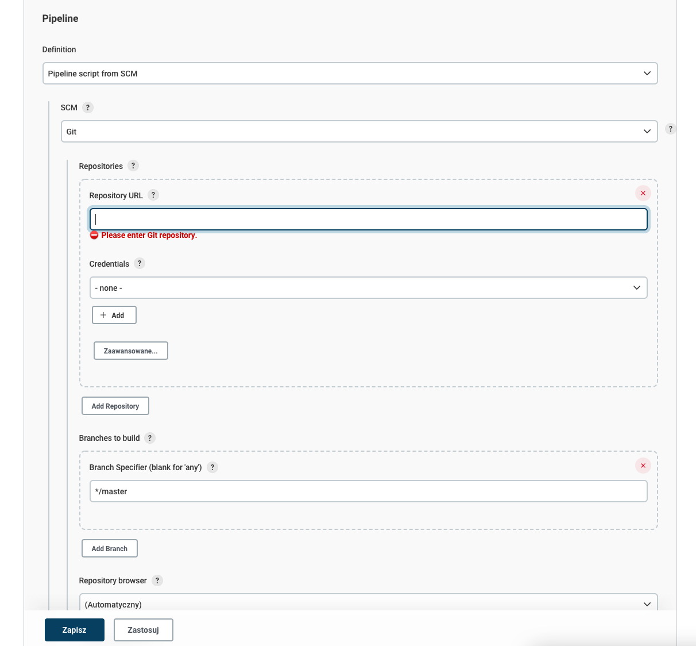
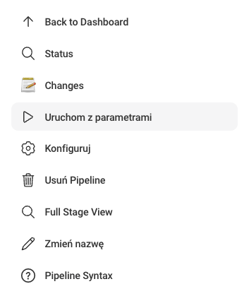
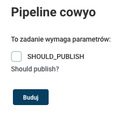
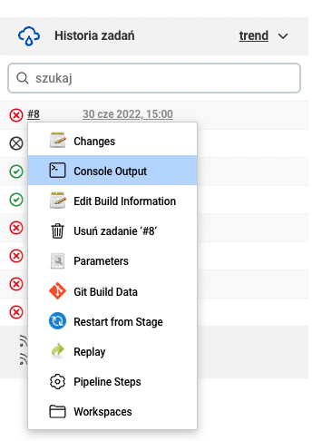

# Integracja projektu Open Source z systemem DevOps

## Wybór projektu
Wybrany projekt to cowyo. Cowyo to aplikacja internetowa napisana w Go, która umoliżliwa tworzenie i edytowanie notatek osobistych za pośrednictwem interfejsu graficznego w przeglądarce. Program udostępnia port HTTP (pod spodem TCP).

### Licencja projektu
Licencja projektu to MIT License. Umożliwia ona swobodne użycie aplikacji do działań komercyjnych.

## Budowa i testy uruchomione lokalnie
Aplikacja Go wymaga kompilacji
```bash
export GO111MODULE=on
go get -v # Instalacja zależności
go test ./... -v # Uruchomienie testów automatycznych
go build -o cowyo # Kompilacja do pliku binarnego cowyo
```

## Konteneryzacja
Autorzy projektu przygotowali plik Dockerfile, na podstawie którego można zbudować obraz kontenera.
```bash
docker build -t cowyo .
```
Uruchlomienie aplikacji:
```bash
docker run -p 8050:8050 cowyo
```
Następnie można udać się do przeglądarki pod adres `http://localhost:8050`, by zobaczyć interfejs graficzny.
Projekt cowyo nie przewiduje użycia za pośrednictwem kodu/terminala.

# Instancja Jenkins
## Instalacja
W celu zainstalowania Jenkinsa, można użyć oficjalnego pakietu WAR.
By uruchomić Jenkinsa, należy wydać następujące polecenia:
```bash
mkdir jenkins
cd jenkins
wget https://get.jenkins.io/war-stable/2.346.1/jenkins.war
java -jar jenkins.war
```

## Wstępna konfiguracja
Po zainstalowaniu Jenkinsa, pojawi się konfigurator wstępny.

Należy podać hasło aktywacyjne, można je odczytać wywołując polecenie: `cat /Users/user/.jenkins/secrets/initialAdminPassword`

Można też zainstalować sugerowane wtyczki

Oraz utworzyć pierwszego użytkownika

## Konfiguracja bezpieczeństwa

Dostęp do poszczególnych elementów Jenkinsa możemy zdefiniować za pomocą macierzy dostępu w zakładce "Konfiguruj ustawienia bezpieczeństwa"


## Utworzenie projektu

Wpierw definiujemy kroki w pliku Jenkinsfile:

```groovy
pipeline {
    agent any
    // Checkbox, który pyta dewelopera, czy pakiet ma zostać opublikowany w Docker Hubie.
    parameters {
       booleanParam(name: 'SHOULD_PUBLISH', defaultValue: false, description: 'Should publish?')
   }
    stages {
        stage('Build') {
            steps {
                // Budowa klasycznego kontenera (zawiera kod źródłowy)
                // Bazowy obraz to golang:1.12-alpine, zalecany obraz dla projektów w Go
                // Logi z budowy są dostępne w zakładce "Console Output" w Jenkinsie
                sh 'docker build -t adrlanek/cowyo:c$GIT_COMMIT .'
            }
        }
        stage('Test') {
            steps {
                // Uruchomienie testów automatycznych
                // Logi z budowy są dostępne w zakładce "Console Output" w Jenkinsie
                sh 'docker run --rm adrlanek/cowyo:c$GIT_COMMIT go test ./...'
            }
        }
        stage('Deploy') {
            steps {
                // Projekt może być dystrybuowany w postaci pliku binarnego jak i obrazu Dockera.
                // Wybrałem dystrybucję za pomocą obrazu Dockera, ponieważ w faktycznych środowiskach uruchomieniowych o wiele łatwiej i przewidywalniej jest dokonywać wdrożeń za pomocą ustandaryzowanych obrazów kontenerów. Pozwala to na proste wdrożenia w systemy orchestracji kontenerów (np. Kubernetes). Plik binarny jest trudniejszy do zarządzania w dużym środowisku wdrożeniowyym.

                // Budowa kontenera wieloetapowego (finalny obraz zawiera jedynie binarkę)
                // Ostatnie polecenie 'curl' sprawdza czy aplikacja poprawnie się uruchomiła
                // Obraz jest tagowany numerem commitu git
                sh '''docker build -t adrlanek/cowyo-runtime:c$GIT_COMMIT -f Dockerfile.multistage .
                                docker rm -f cowyo-app || exit 0
                                docker run -d --name cowyo-app -p 8050:8050 adrlanek/cowyo-runtime:c$GIT_COMMIT
                                sleep 10
                                curl \'http://localhost:8050/\''''
            }
        }
        stage('Publish') {
            when {
                expression { params.SHOULD_PUBLISH }
            }
            steps {
                // Wypchnięcie obrazu do Docker Huba
                sh 'docker push adrlanek/cowyo-runtime:c$GIT_COMMIT'
            }
        }
    }
}
```

Tworzymy projekt, klikając przycisk "Nowy projekt" w panelu głównym

Następnie ustawiamy źródło definicji pipeline jako Jenkinsfile pobrany z systemu kontroli wersji i klikamy "Zapisz"



Po utworzeniu projektu na Jenkinsie, możemy uruchomić build'a:



Podczas uruchamiania pojawi się też checkbox pytający dewelopera czy chce opublikować pakiet w Docker Hubie:



Możemy też zobaczyć szczegóły poszczególnych buildów:



W ten sposób Jenkins w pełni zautomatyzował proces budowy i dystrybucji aplikacji.